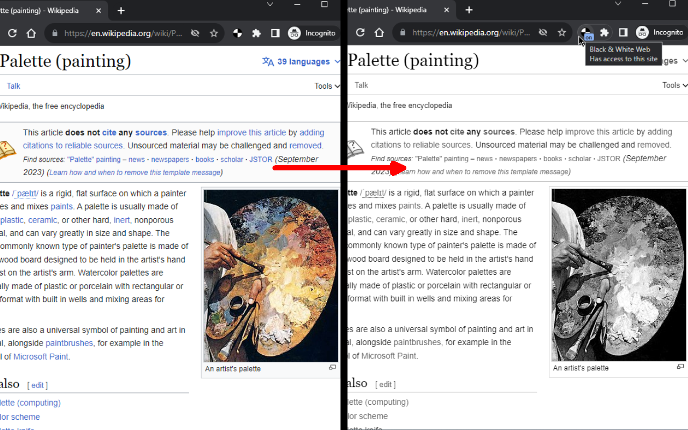

# Black & White Web
Browse the Web in Black & White.

# Overview
Click on the extension icon to turn any web page into Black & White.

Now you can also black list or white list urls in combination with Always ON option.

Since v0.1.2 new options page added:
 - turn the extension always ON (also good for pranks :P )
 - show animated transition

CHANGELOG: https://github.com/azrafe7/blackAndWhiteWeb/blob/main/CHANGELOG.md
